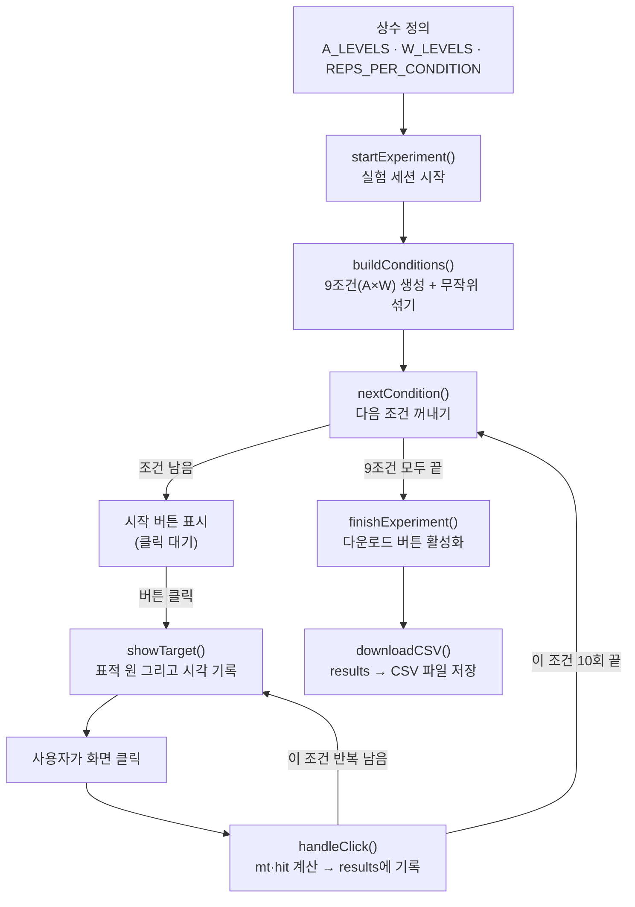
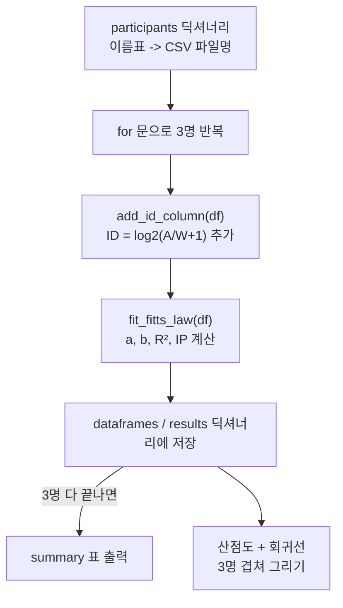

# EXPLAIN.md — pointing_task.html (루프 1, 항목 2)

> 200줄 미만 프로토타입 규칙에 따라, 구조 요약보다 **한 줄씩 읽기**를 우선한다.

## 0. 이 코드를 읽기 전에 알아야 할 개념

초심자용으로, 이 파일 하나를 이해하는 데 필요한 만큼만 짧게 정리했다. 이미 아는 항목은 건너뛰어도 된다.

- **DOM과 이벤트 리스너**: 웹페이지의 버튼·박스 같은 요소를 자바스크립트가 직접 조작하는 걸 "DOM 조작"이라 한다. "클릭하면 뭔가 일어난다"는 `addEventListener('click', 함수)`로 만든다. 이 코드는 192번째 줄에서 playArea 전체에 클릭 리스너를 딱 하나만 걸어두고, 클릭한 게 표적인지 아닌지는 함수 안에서 나중에 구분한다.
- **전역 상태(state) 변수**: 서버도 React 같은 프레임워크도 없는 순수 JS라서, "지금 몇 번째 조건인지"(`condIndex`), "몇 번째 시행인지"(`repIndex`), "지금까지 기록"(`results`) 같은 정보를 그냥 파일 맨 위 변수에 저장해두고 모든 함수가 공유해서 읽고 쓴다. 이 코드가 "함수형"이 아니라 "상태 기반"으로 짜인 이유다.
- **CSS 절대 위치(absolute positioning)**: 표적 원을 화면의 특정 좌표에 그리려면 `position:absolute`로 두고 `left`/`top` 픽셀 값을 계산해서 넣는다. `showTarget()`이 이 계산을 한다.
- **Fisher–Yates 셔플**: 배열을 편향 없이 완전히 무작위로 섞는 표준 알고리즘. 뒤에서부터 앞으로 오면서 무작위 위치와 교환한다. `buildConditions()`가 9개 조건 순서를 섞을 때 쓴다. (그냥 정렬 함수에 무작위 비교자를 넣으면 편향이 생겨서 이 알고리즘을 따로 쓴다.)
- **`performance.now()`**: `Date.now()`보다 훨씬 정밀한(밀리초 이하 단위) 시간 측정 함수. 반응시간처럼 짧은 시간차를 잴 땐 이걸 쓴다. 표적이 뜬 시각과 클릭한 시각의 차이가 곧 이동시간(MT)이다.
- **유클리드 거리(피타고라스 정리)**: 클릭 좌표와 표적 중심 좌표 사이 직선 거리를 `sqrt((x1-x2)² + (y1-y2)²)`로 구해서, 그게 W/2(반지름)보다 작으면 "명중(hit)"으로 판정한다.
- **Blob과 파일 다운로드**: 서버 없이 브라우저 안에서 텍스트를 파일로 저장하는 표준 트릭. 문자열을 `Blob`으로 감싸고 `URL.createObjectURL`로 임시 다운로드 주소를 만든 뒤, 보이지 않는 `<a>` 태그를 코드로 클릭시켜서 다운로드를 일으킨다.

## 1. 전체 구조와 데이터 흐름

단일 HTML 파일. 서버도 프레임워크도 없이 순수 JS + DOM만 쓴다. 상태는 전부 전역 변수(`conditions`, `condIndex`, `repIndex`, `results` 등)에 저장된다 — 서버 저장 없음, 브라우저 안에서만 돈다.

(GitHub이나 VS Code 미리보기에서 이 다이어그램이 그림으로 렌더링된다. 텍스트로만 보인다면 화살표를 그대로 순서도로 읽으면 된다.)

## 2. 함수별 한 줄 요약

| 함수 | 한 줄 요약 |
|---|---|
| `shuffle(arr)` | 배열 순서를 무작위로 섞는다 (Fisher-Yates) |
| `buildConditions()` | A×W 9개 조합을 만들고 섞는다 |
| `showTarget(side, A, W)` | 지정한 위치·크기로 표적 원을 화면에 그린다 |
| `updateStatus()` | 화면 상단 상태 텍스트를 갱신한다 |
| `nextCondition()` | 다음 조건으로 넘어가거나(끝났으면 종료), "시작" 버튼을 보여준다 |
| `handleClick(evt)` | 클릭이 표적 안인지 계산하고 시행 결과를 기록한다 |
| `startExperiment()` | 조건 목록을 만들고 실험을 처음 시작한다 |
| `finishExperiment()` | 상태 메시지를 "완료"로 바꾸고 다운로드 버튼을 켠다 |
| `downloadCSV()` | 기록된 시행들을 CSV 파일로 내려받는다 |

## 3. 실행 순서대로 (줄 단위)

1. **41~44줄**: 실험 설계 상수 정의. A(거리) 150/300/450px, W(폭) 20/50/100px → 3×3=9조건. 조건당 10회 이동.
2. **194줄**: 파일 맨 아래에서 `startExperiment()` 호출로 실행이 시작된다.
3. **161~166줄 `startExperiment`**: `buildConditions()`로 9조건을 섞은 배열을 만들고, `condIndex=0`, `results=[]`로 초기화한 뒤 `nextCondition()` 호출.
4. **69~77줄 `buildConditions`**: 이중 for문으로 A×W 9쌍을 만들고 `shuffle()`로 순서를 섞어 반환.
5. **104~124줄 `nextCondition`**: `condIndex`가 배열 길이를 넘으면 `finishExperiment()`로 종료. 아니면 현재 조건의 A/W를 꺼내고, `repIndex=0`, 시작 위치(L/R)를 무작위로 정한 뒤 `updateStatus()`. 그리고 playArea에 "다음 조건 시작" 버튼을 하나 그린다 — **이 버튼을 눌러야만** `showTarget()`이 호출된다. (조건이 바뀔 때 이전 조건의 표적 위치가 다음 조건 첫 이동에 영향 주는 걸 막기 위한 장치.)
6. **80~95줄 `showTarget`**: playArea 중앙(cx,cy)을 기준으로 side가 L이면 왼쪽, R이면 오른쪽으로 A/2만큼 떨어진 위치에 지름 W인 원을 그린다. 그 원의 중심 좌표를 `dataset.cx/cy`에 저장해두고, `performance.now()`로 표적이 나타난 시각(`lastAppearTime`)을 기록한다.
7. **192줄**: playArea 전체에 클릭 리스너가 걸려있다 — 원을 클릭하든 빈 곳을 클릭하든 `handleClick`이 불린다.
8. **127~158줄 `handleClick`**: 클릭한 대상이 `.target` 클래스가 아니면(=원이 아니면) 그냥 무시(129줄). 원이면:
   - `mt` = 지금 시각 − `lastAppearTime` (표적이 나타난 뒤부터 클릭까지 걸린 시간)
   - 클릭 좌표와 표적 중심 좌표 사이 거리(`dist`)를 구해서, `W/2`(반지름) 이내면 `hit=1`, 아니면 `hit=0`
   - `results` 배열에 이번 시행 기록 push
   - 다음 표적은 반대쪽(L↔R)으로 지정
   - `repIndex`가 `REPS_PER_CONDITION`(10)에 도달했으면 `condIndex++` 후 `nextCondition()`(다음 조건의 "시작" 버튼으로), 아니면 바로 `showTarget()`으로 다음 표적 표시.
9. 9개 조건이 다 끝나면 5번 단계에서 `finishExperiment()`가 호출되어 다운로드 버튼이 나타난다.
10. **177~190줄 `downloadCSV`**: `results` 배열을 `condition,A,W,rep,side,mt_ms,hit` 형식의 CSV 문자열로 합쳐서, `Blob` → `URL.createObjectURL` → 가짜 `<a>` 태그 클릭으로 `fitts_trials.csv` 파일을 내려받는다.

**의도적으로 빠진 것**: CSV에 `log2(A/W+1)` 컬럼이 없다 (176줄 주석 참고) — 체크리스트 4번 항목에서 직접 계산해볼 부분이라 일부러 뺐다.

## 4. 코드

`loops/01-fitts-law/pointing_task.html` 참고 (205줄, 전체 파일).

## 5. 이후 변경 사항

- CSV를 파일 자동 다운로드 대신 화면 textarea에 띄워 복사하는 방식으로 변경 (태블릿 등 샌드박스 환경에서 다운로드가 막히는 문제 회피).
- **버그 수정**: `handleClick`이 원(`.target`) 바깥 클릭을 아예 무시해서 오류(miss)가 시행으로 기록되지 않던 문제. 표적 중심 좌표(`targetCx/targetCy`)를 `showTarget()`에서 전역으로 저장해두고, 클릭이 원 안이든 밖이든(시작 버튼만 제외) 한 번의 시행으로 기록하도록 고침. 이미 수집된 90개 시행(item 3 데이터)에는 소급 적용되지 않음 — 그 데이터는 원 클릭만 기록된 것이라 hit이 전부 1.
- 2026-09-14: 버그 수정된 버전으로 재수집한 90개 시행으로 `fitts_trials.csv` 교체. hit=0인 시행이 처음으로 포함됨(조건1, 6번째 시행).

---

# EXPLAIN.md — fitts_regression.py (루프 1, 항목 5)

## 0. 이 코드를 읽기 전에 알아야 할 개념

- **최소자승법(least squares)과 `np.polyfit`**: 점들 사이를 지나는 "가장 오차가 작은 직선"을 찾는 표준 방법. `np.polyfit(x, y, 1)`은 x,y 점들에 1차식(직선)을 맞춰서 `[기울기, 절편]` 순서의 배열을 돌려준다. 순서가 `[기울기, 절편]`이라 코드에서 `b, a = np.polyfit(...)`로 받는다 — a가 먼저 나올 거라 생각하기 쉬운데 반대다.
- **R²(결정계수) 직접 계산**: 라이브러리에 내장 함수가 없어서 정의대로 계산한다. `ss_res`(실제값과 예측값의 차이 제곱합, "모델이 못 맞춘 정도")를 `ss_tot`(실제값과 평균의 차이 제곱합, "원래 데이터가 흩어진 정도")로 나눈 뒤 1에서 빼면 R². 모델이 완벽하면 `ss_res=0`이라 R²=1.
- **딕셔너리를 활용한 반복 처리**: 참가자 이름표를 key, CSV 파일명을 value로 둔 `participants` 딕셔너리 하나를 만들고, `for label, filename in participants.items():`로 3명을 순서대로 돌린다. 계산 함수(`fit_fitts_law`)는 한 번만 정의해두고 3번 호출한다 — 복사·붙여넣기 대신 함수로 재사용하는 구조.
- **`np.linspace`**: 시작값과 끝값 사이를 지정한 개수만큼 균등하게 나눈 숫자 배열을 만든다. 회귀선을 매끄러운 직선으로 그리기 위해, 실제 데이터의 ID 최소~최대 구간을 50개 점으로 채워서 그 점들 위에 회귀식을 계산해 선을 그린다.

## 1. 전체 구조와 데이터 흐름

CSV 3개(본인/가족1/가족2) → 각각 ID 컬럼 추가 → 각각 따로 회귀 적합(a,b,R²,IP) → 결과 표로 비교 + 그래프로 시각화.

## 2. 함수별 한 줄 요약

| 함수 | 한 줄 요약 |
|---|---|
| `add_id_column(df)` | A/W로 난이도 지수 ID 컬럼을 계산해 추가한다 |
| `fit_fitts_law(df)` | ID~mt_ms 최소자승 회귀로 a, b, R², IP를 계산한다 |

## 3. 실행 순서대로

1. `participants` 딕셔너리에 참가자 3명의 이름표와 CSV 파일명을 적어둔다.
2. `for label, filename in participants.items():` 로 한 명씩 처리:
   - `pd.read_csv(filename)`으로 CSV를 읽고 `add_id_column()`으로 ID 컬럼 추가.
   - `fit_fitts_law()`로 그 사람만의 a, b, R², IP 계산.
   - 결과를 `dataframes`, `results` 딕셔너리에 이름표를 key로 저장.
3. 3명이 다 끝나면 `results`를 표(`DataFrame`)로 변환해 출력 — 참가자별 a/b/r2/ip를 한눈에 비교.
4. 마지막으로 `dataframes`를 다시 돌면서 참가자별 산점도(옅은 점)와 그 사람의 회귀선(진한 선)을 한 그래프에 겹쳐 그린다.

## 4. 코드

`loops/01-fitts-law/fitts_regression.py` 참고 (전체 파일, 60줄 미만).
